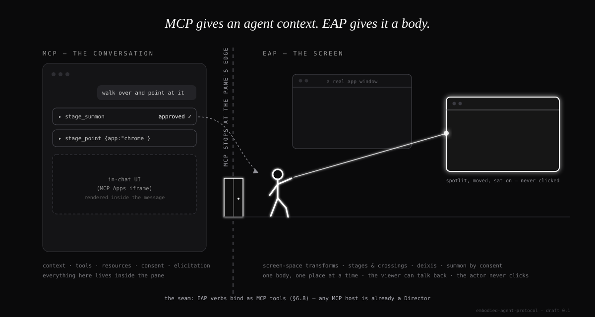

# Embodied Agent Protocol (EAP)

**An open protocol for embodied agents.** Draft 0.1, August 2026.

*MCP gives an agent context. EAP gives it a body.*



Agents can already act. What they cannot do is be **seen deciding**: attention, intention, and confidence all live in scrolling text. EAP gives an agent a body on the user's screen: a character that is summoned by consent, walks across real surfaces (the OS desktop, a web page, a browser tab), points at real UI elements, and hands off between surfaces with pixel agreement, so one continuous character can cross from the operating system into a website.

The body is not decoration. It is a consent surface: a body telegraphs intent at human speed, before anything happens, in a form a person can veto by reflex.

## The one rule that defines the protocol

**The actor never clicks.** An embodied agent under EAP points, walks, speaks, and waits. The human acts. Actuation is not a missing feature; its absence is the trust model, and it is normative (see SPEC.md section 8).

## What is in this repo

```
README.md          this file
SPEC.md            the protocol: roles, coordinate model, verbs, consent, conformance
CONFORMANCE.md     MUST / SHOULD / MAY checklists per role
schemas/           JSON Schemas for every message
  envelope.schema.json
  stage.schema.json
  verbs.schema.json
  descriptor.schema.json
  cast.schema.json
```

## How it relates to MCP

EAP is a companion to the Model Context Protocol, not a fork of it. The boundary is the edge of the chat pane.

| | MCP owns | EAP owns |
|---|---|---|
| **Territory** | the conversation | the screen |
| **Surface** | messages, tool results, MCP Apps iframes *inside* the pane | stages: the OS desktop, web pages, browser tabs |
| **Geometry** | none — the pane lays itself out | screen-space transforms, heartbeats, staleness, anchors |
| **Presence** | text and inline UI | one actor, one place at a time, crossing surfaces with pixel agreement |
| **Pointing** | citations and links | deixis: a body walking to a real window or element and indicating it |
| **Input** | prompts, elicitation | the viewer talking to the actor on stage, relayed to the Director |
| **Consent** | tool-call approval | that same approval, reused as the summon artifact — plus a panic gesture |
| **Actuation** | whatever the tool does | **none. The actor never clicks.** |

MCP (spec 2026-07-28) carries tools and context; the MCP Apps extension (2026-01-26) renders UI *inside* the chat pane. Everything MCP does ends at the pane's edge. EAP picks up exactly there and owns the rest of the screen: characters on the desktop and in pages, crossing between them. The seam is section 6.8: EAP verbs bind as MCP tools, which makes any MCP client a Director with zero new plumbing, and makes summoning a consented tool call.

## Status and license

Draft 0.1: seeking a second independent implementation before 0.2. Spec text intended for CC BY 4.0, schemas MIT, so that anyone can implement without asking. Every copy of this idea should be an implementation of this spec.
